# 🥑 ML-project6-Avocado-Market-prediction


A machine learning project for predicting avocado market prices.

---


## 📈 Project Overview

This repository demonstrates how to use regression techniques to predict avocado prices based on historical market data. The project includes an interactive Jupyter notebook and a dataset of avocado sales from various regions.

---

## 📁 Repository Contents

| File/Folder                                 | Description                                   |
|---------------------------------------------|-----------------------------------------------|
| `Project 4 - Avocado Prices Prediction.ipynb` | Jupyter Notebook with code and explanations   |
| `Project 4 - Predict Avocado Prices.pptx`   | Project presentation slides                   |
| `avocado.csv`                              | Avocado market dataset                        |
| `LICENSE`                                  | License information                           |
| `README.md`                                | This file                                     |

---

## ⚙️ Workflow Flowchart

```mermaid
flowchart TD
    A[Start] --> B[Load Data 📥]
    B --> C[Explore & Visualize Data 📊]
    C --> D[Preprocess Data 🧹]
    D --> E[Build & Train Regression Model 🤖]
    E --> F[Predict Avocado Prices 💵]
    F --> G[Evaluate Model Performance 📈]
    G --> H[End]
```



---

## 🚀 Quick Start

1. **Clone the repository:**
   ```bash
   git clone https://github.com/mdzaheerjk/ML-project6-Avocado-Market-prediction.git
   ```

2. **Open the Jupyter Notebook:**
   - Make sure you have Python and Jupyter installed.
   - Launch `Project 4 - Avocado Prices Prediction.ipynb`.

3. **Run the notebook:**
   - Follow the step-by-step instructions.
   - Explore the data, train the model, and visualize predictions.

---

## 🧰 Requirements

- 
- 
- 
- 
- 
- 

Install dependencies with:
```bash
pip install pandas numpy matplotlib seaborn scikit-learn notebook
```

---

## 🏆 Results & Insights

- Accurate avocado price predictions using regression models.
- Visual insights on market trends and model performance.

---

## 📄 License

This project is licensed under the [MIT License](LICENSE).

---

## 👤 Author

**mdzaheerjk**

---
